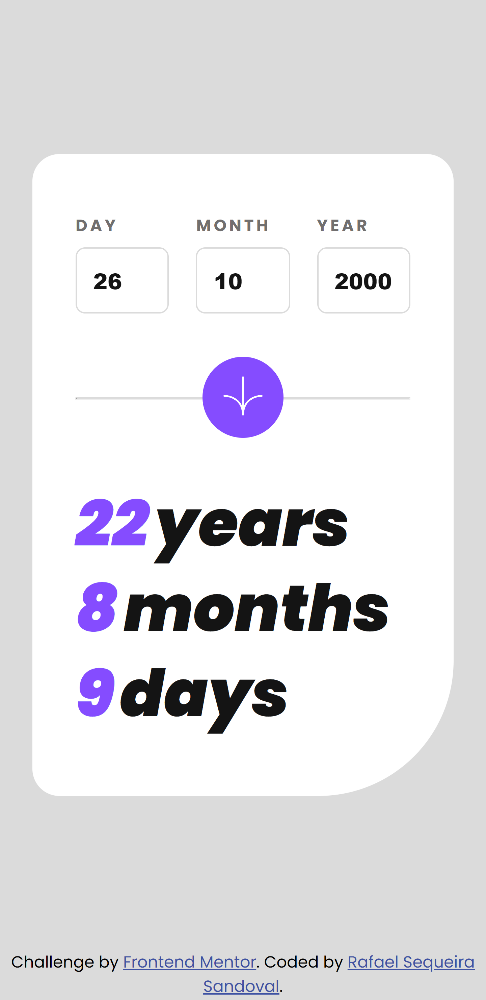

# Frontend Mentor - Age calculator app solution

This is a solution to the [Age calculator app challenge on Frontend Mentor](https://www.frontendmentor.io/challenges/age-calculator-app-dF9DFFpj-Q). Frontend Mentor challenges help you improve your coding skills by building realistic projects. 

## Table of contents

- [Overview](#overview)
  - [The challenge](#the-challenge)
  - [Screenshot](#screenshot)
  - [Links](#links)
- [My process](#my-process)
  - [Built with](#built-with)
  - [What I learned](#what-i-learned)
  - [Continued development](#continued-development)
- [Author](#author)

## Overview

### The challenge

Users should be able to:

- View an age in years, months, and days after submitting a valid date through the form
- Receive validation errors if:
  - Any field is empty when the form is submitted
  - The day number is not between 1-31
  - The month number is not between 1-12
  - The year is in the future
  - The date is invalid e.g. 31/04/1991 (there are 30 days in April)
- View the optimal layout for the interface depending on their device's screen size
- See hover and focus states for all interactive elements on the page
- **Bonus**: See the age numbers animate to their final number when the form is submitted

### Screenshot

#### Desktop

#### Mobile

### Links

- Live Site URL: [Add live site URL here](https://rafaelss427.github.io/age-calculator-app/)

## My process

### Built with

- JSX
- CSS custom properties
- CSS module stylesheet
- Flexbox
- [React](https://reactjs.org/) - JS library
- [React hook form](https://react-hook-form.com/) - For form
- [Animejs](https://animejs.com/) - For animation
- [Date-fns](https://date-fns.org/) - For date

### What I learned
I learned many things I would like to mention.
 1. I learned about the correct handling of forwardRef. I had to wrap my InputApp component with it to keep the reference to my input tag.
 2. I improved my knowledge in the use of the reak-hook-form and animejs libraries

### Continued development

I would like to focus on the responsive design. I feel that it's an area in which I should improve.

## Author

- Website - In process
- Frontend Mentor - [@RafaelSS427](https://www.frontendmentor.io/profile/@RafaelSS427)
